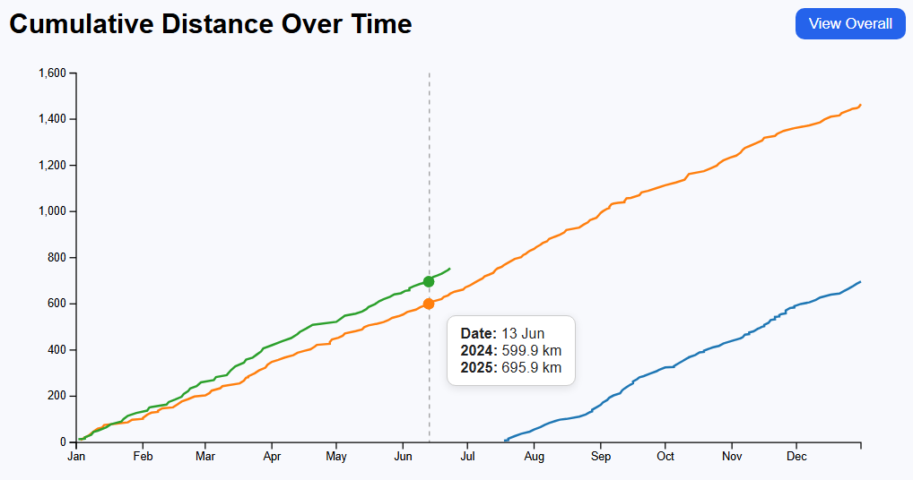
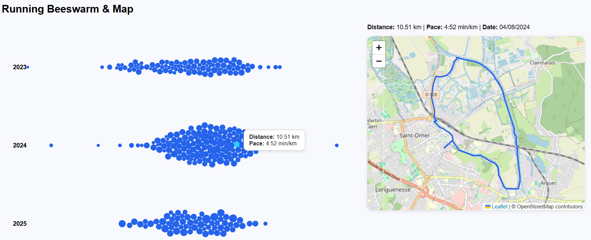

# Dataviz_Garmin

A full-stack personal analytics dashboard built on Garmin activity exports.

This project combines a **Flask REST API**, a **SQLite data layer**, and a **React + D3 frontend** to transform raw Garmin health and activity data into interactive visualizations such as cumulative running distance, yearly activity distributions (beeswarm plot), and future sleep analytics.

The goal is to explore **data engineering, API design, and interactive data visualization** using real-world personal data.

---

## Preview

### Cumulative Distance Visualization

### Yearly Activity Beeswarm

---

## Key Features

- Interactive cumulative distance chart built with D3
- Yearly beeswarm visualization of activities
- Flask-based REST API serving structured activity data
- SQLite querying over Garmin export databases
- Environment-based configuration for flexible deployment
- Modular full-stack architecture

---

## Technical Highlights

- Processed multiple years of Garmin activity data
- Queried thousands of activity records via SQLite
- Designed and exposed RESTful endpoints using Flask
- Built interactive D3 visualizations with dynamic scaling and hover interactions
- Implemented environment-based configuration using `.env`
- Structured a maintainable full-stack project (backend + frontend separation)

---

## Architecture

Garmin SQLite Databases  
↓  
Flask REST API (backend/)  
↓  
React Client (frontend/)  
↓  
D3 Interactive Visualizations  

The backend handles data extraction and transformation, while the frontend focuses purely on visualization and UI logic.

---

## Project Structure

Dataviz_Garmin/  
│  
├── Data/DBs/               # Garmin SQLite exports  
│  
├── backend/                # Flask API  
│   ├── app.py              # REST endpoints  
│   ├── make.py             # Helper to rebuild GarminDB exports  
│   └── .env.example        # Environment configuration template  
│  
├── frontend/               # React + Vite client  
│   ├── public/  
│   └── src/  
│  
├── LICENSE  
└── README.md  

---

## Data Sources

The backend connects to two SQLite databases:

- `garmin_activities.db` – activity summaries and detailed records  
- `garmin.db` – additional metrics such as sleep entries  

These files can be generated by exporting data from Garmin Connect or by using the upstream GarminDB project.

Place the generated databases inside `Data/DBs/` or configure custom paths via environment variables.

---

## Configuration

The backend uses environment variables to configure database locations.

### 1. Copy the example environment file

cd Dataviz_Garmin/backend  
cp .env.example .env  

### 2. Configure variables inside `.env`

- `GARMIN_DB_DIR` – directory containing both databases  
- `GARMIN_ACTIVITIES_DB` – optional full path override  
- `GARMIN_DB` – optional full path override  
- `GARMINDB_TARGET_DIR` – path to GarminDB repository (for `make.py`)

### 3. Load environment variables

Bash:  
set -a; source .env; set +a  

PowerShell:  
Load manually or configure your IDE to auto-load `.env`.

---

## Setup & Usage

### Backend

cd Dataviz_Garmin/backend  
python -m pip install flask flask-cors  
python app.py  

The API runs by default at:

http://127.0.0.1:5000

---

### Frontend

cd Dataviz_Garmin/frontend  
npm install  
npm run dev  

Open the displayed local URL (typically http://localhost:5173 if using Vite).

If you change the backend port, update the fetch URLs inside the React source.

---

### Rebuilding the SQLite Databases (Optional)

cd Dataviz_Garmin/backend  
python make.py all  

This forwards commands to your local GarminDB installation.

---

## Future Improvements

- Sleep dashboard visualization  
- Pace and heart-rate trend analysis  

---

## What I Learned

- Designing REST APIs over local relational databases  
- Structuring full-stack applications cleanly  
- Building interactive D3 visualizations  
- Managing environment-based configuration securely  
- Handling cumulative time-series metrics correctly  
- Separating data logic from visualization logic  

---

## Tech Stack

Backend:
- Python
- Flask
- SQLite

Frontend:
- React
- Vite
- D3.js

Tooling:
- Node.js
- npm
- Environment variables (.env)

---

## License

MIT License
